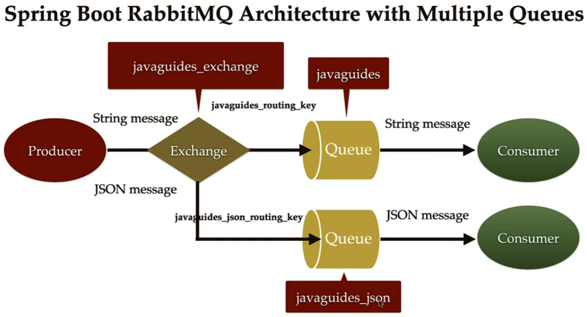

# Demo do RabbitMQ com SpringBoot

Este é um projeto de aprendizado para a integração do RabbitMQ com o SpringBoot.

Arquitetura:


## Execução

Primeiro é necessário construir um Contêiner com o Docker para o RabbitMQ:
```
$ docker run -it -d --hostname my-rabbit --name meu-rabbitMq -e RABBITMQ_DEFAULT_USER=user -e RABBITMQ_DEFAULT_PASS=senha -p 15672:15672 -p 5672:5672 rabbitmq:3-management
```

Parar com:
```
$ docker stop meu-rabbitMq
```

Nas próximas vezes, iniciar com: 
```
$ docker start meu-rabbitMq
```